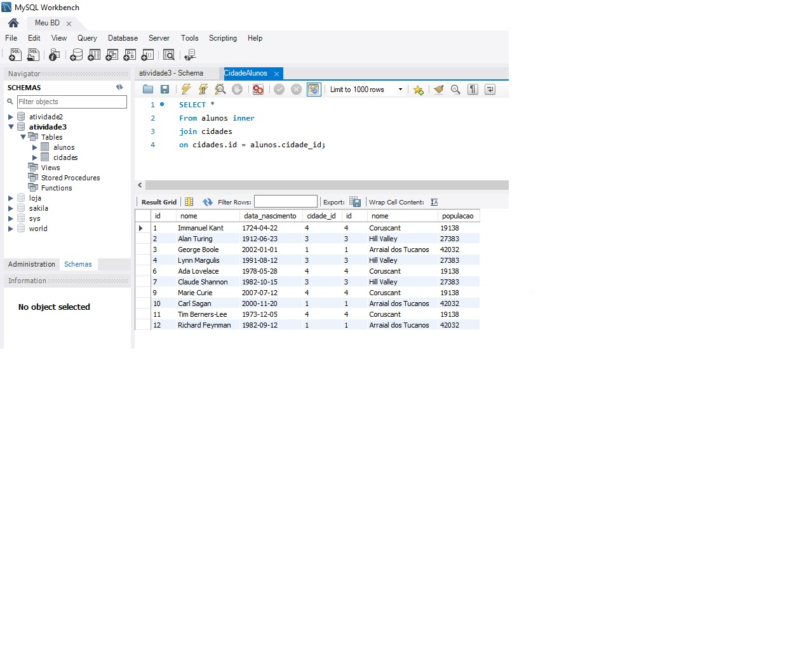
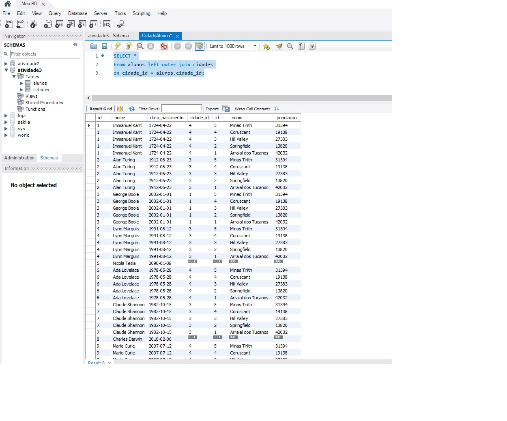
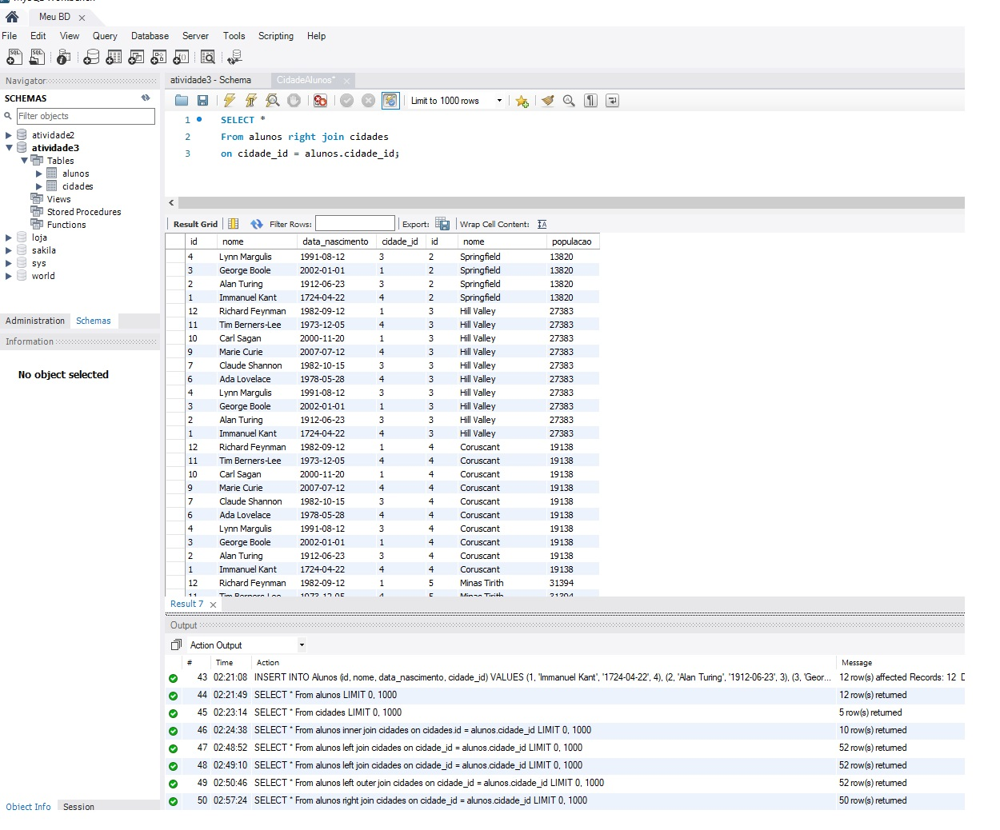

# Alunos-e-Cidades

1. Igualdade entre as chaves estrangeiras utilizando a sintaxe INNER JOIN
retornado apenas as linhas que casam ambas em as tabelas:

.
 
2. A consulta retornar todos os registros da tabela à esquerda
 (tabela principal) e os registros correspondentes da tabela à direita
 (ou NULL se não houver correspondência).

.

3.Agora temos todos os registros da tabela à
direita e os registros correspondentes da tabela à esquerda.

.
